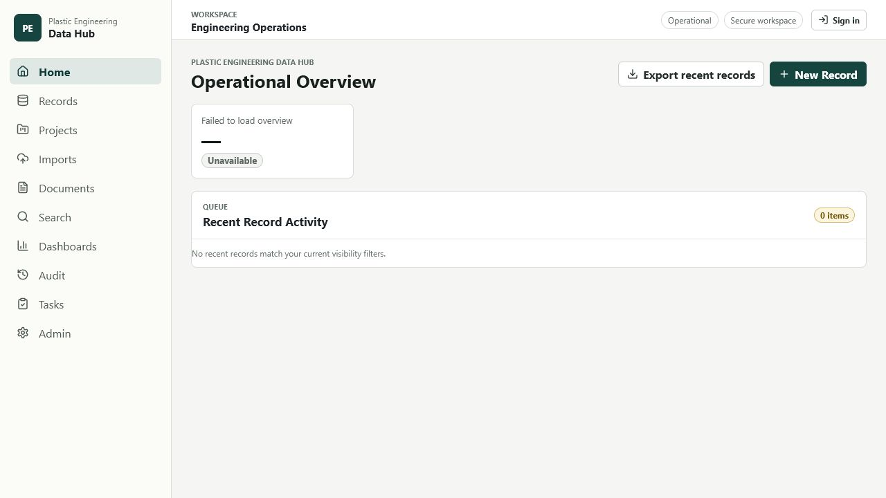
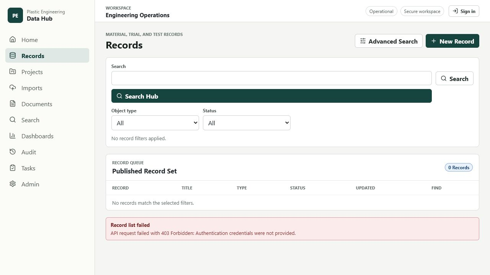
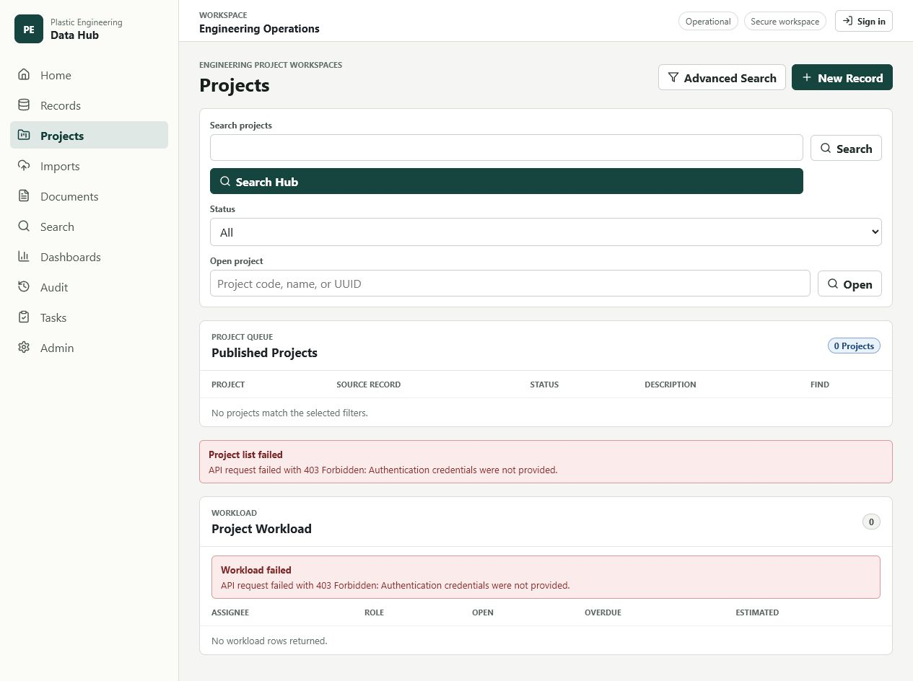
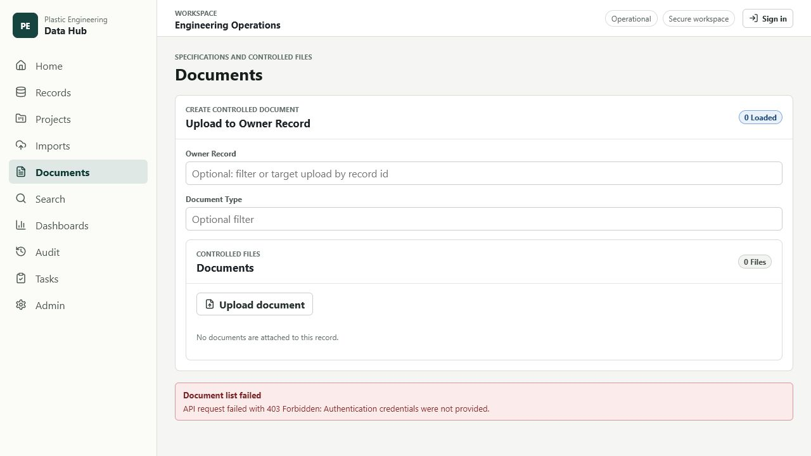
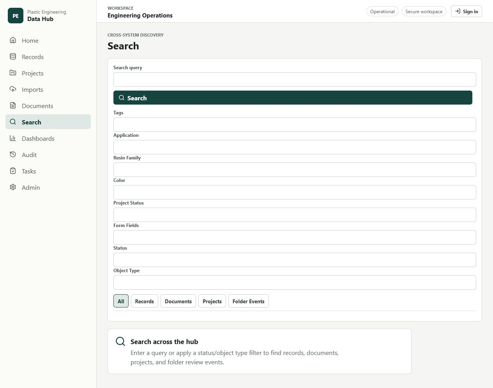
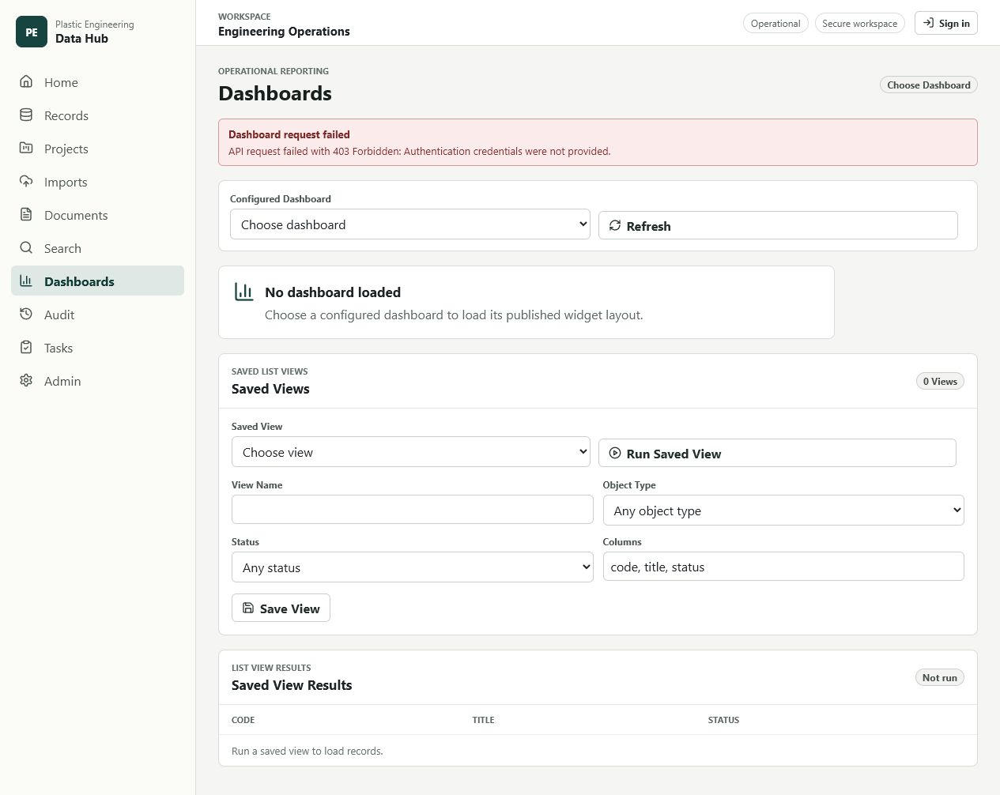
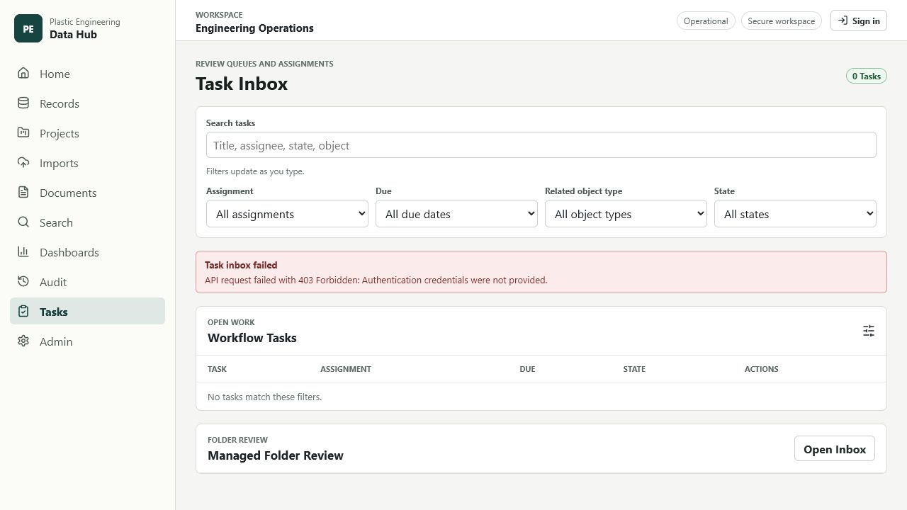
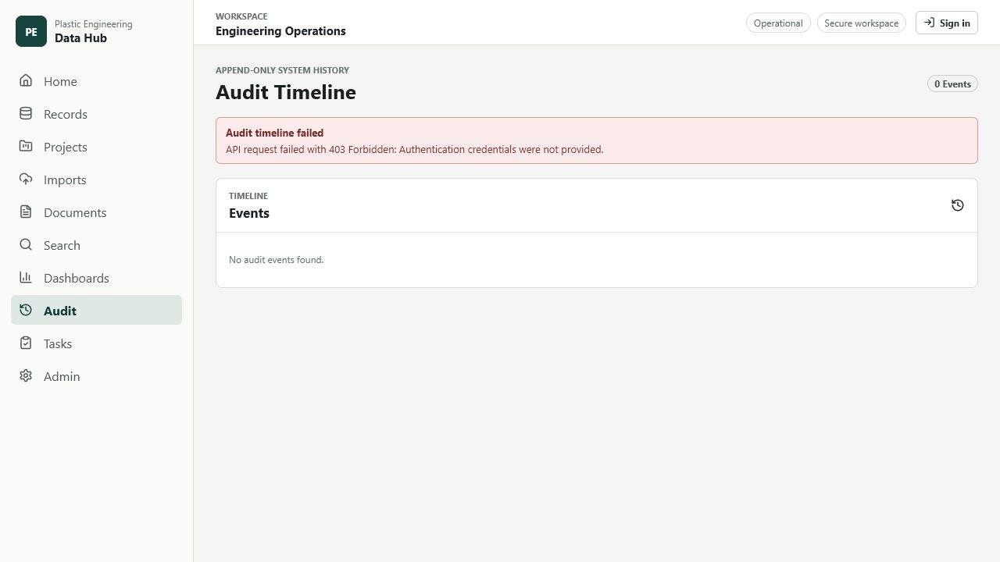
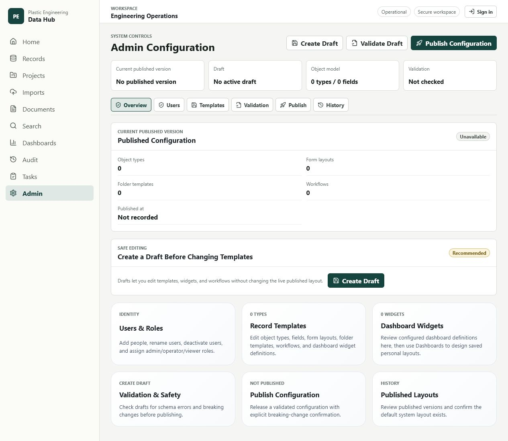
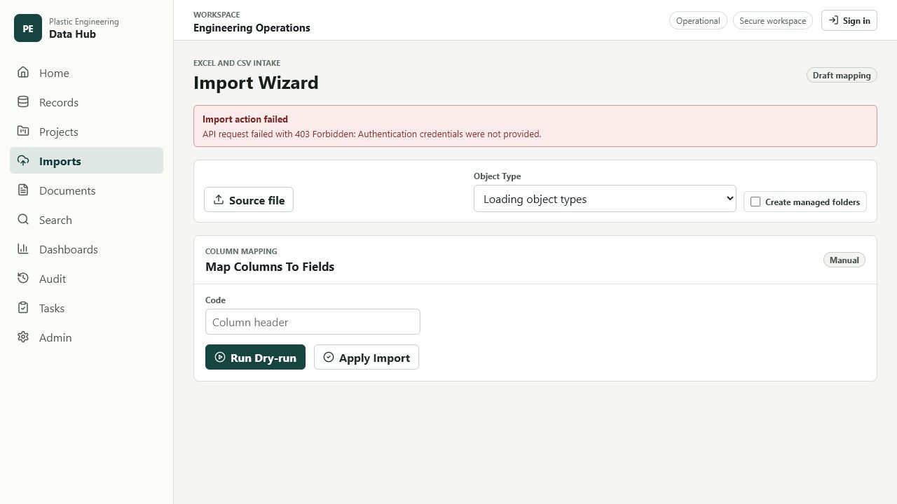

# Plastic Engineering Data Hub User Manual

## 1. What This System Is For

Plastic Engineering Data Hub is the working system of record for plastic engineering data, documents, projects, workflows, and search. It is designed for teams that need traceability across raw materials, products, product specifications, suppliers, customers, projects, test methods, documents, tasks, and audit evidence.

Use the system to answer practical operating questions:

- Which raw material was used for this product or trial?
- Which controlled document or revision supports this record?
- Which projects are active, blocked, overdue, or archived?
- Which tasks need engineering, quality, or admin attention?
- Which records changed, who changed them, and when?
- Which documents are missing, stale, or linked to released records?

The system is not a shared file drive. Files belong in the document registry and should be linked to the records, projects, or tasks they support. The record, document, workflow, and audit links are what make the data reliable.

## 2. Access, Login, And Roles

Open the application URL provided by your administrator. In local development this is commonly `http://127.0.0.1:5173/` or `https://plastic-hub.local`.

Sign in with the username and password issued by your administrator. Production passwords and secrets are never stored in this manual or in source code. They must be managed through the deployment `.env`, the identity provider, or the administrator's credential process.

Common roles:

| Role | Typical access |
| --- | --- |
| System Admin | Users, roles, configuration, audit, backups, and emergency support. |
| Engineering Admin | Records, projects, specs, workflows, and engineering dashboards. |
| Quality Reviewer | Review, release, document health, compliance evidence, and audit checks. |
| Purchasing Or Supplier Quality | Supplier and raw-material records, supplier documents, and approval data. |
| Read Only Viewer | Released records, linked documents, dashboards, and saved search results. |

If you can see a page but cannot perform an action, the most likely cause is role permission. Ask a System Admin to check your group membership and object permissions.

## 2A. Installation, Startup, And Deployment

This section is for the administrator or implementation owner responsible for getting the system online. Normal end users can skip to the navigation sections after their account is created.

### 2A.1 Prerequisites

Before installation, prepare:

| Requirement | Production recommendation |
| --- | --- |
| Server | Linux server or Windows Server host capable of running Docker. |
| CPU | Minimum 4 cores for a small team; 8 cores recommended for heavier document/search usage. |
| Memory | Minimum 16 GB RAM; 32 GB recommended for larger document sets. |
| Storage | Minimum 250 GB SSD; keep at least 2x managed/media data size available for backup staging. |
| Runtime | Docker Engine or Docker Desktop with Docker Compose v2. |
| Network | Internal DNS name for the app host, reachable by intended users. |
| Security | VPN-only or internal-network-only exposure for production. |
| HTTPS | IT-provided internal certificate/key or approved internal TLS strategy. |
| Email | SMTP details if notification email is enabled. |
| Credentials | Production `.env` values generated before launch. |
| Browser | Current Chrome, Edge, Firefox, or Safari for users. |

Install these tools on the deployment workstation or server:

```sh
git --version
docker --version
docker compose version
```

If any command is missing, install Git and Docker before continuing.

### 2A.2 Get The Application Code

Clone the repository on the server or deployment machine:

```sh
git clone <repository-url> plastic-engineering-data-hub
cd plastic-engineering-data-hub
```

If the repository is already present, fetch the release branch or tag approved for deployment:

```sh
git fetch --all --prune
git checkout <release-branch-or-tag>
```

### 2A.3 Create The Environment File

Create the deployment environment file from the safe template:

```sh
cp .env.example .env
```

On Windows PowerShell:

```powershell
Copy-Item .env.example .env
```

Edit `.env` and replace every placeholder value. Required production values include:

| Key | What to set |
| --- | --- |
| `SECRET_KEY` | Unique Django secret key for this deployment. |
| `POSTGRES_PASSWORD` | Strong database password. |
| `DATABASE_URL` | Database URL using the chosen database password and service host. |
| `MEILI_MASTER_KEY` | Strong Meilisearch master key. |
| `APP_HOST` | Production internal DNS name. |
| `ALLOWED_HOSTS` | App hostnames allowed by the backend. |
| `CSRF_TRUSTED_ORIGINS` | HTTPS origins allowed for browser requests. |
| `TIME_ZONE` | Operational time zone for scheduled jobs and backups. |
| `BACKUP_ROOT` | Backup destination inside the container or mounted volume. |
| `MEDIA_ROOT` | Managed media/document storage path. |
| `RELEASE_ADMIN_PASSWORD` | Initial release admin password if using the release-prep command. |
| `CADDY_TLS_DIRECTIVE` | Internal TLS directive or certificate/key path for Caddy. |

Do not send `.env` by email, chat, or ticket comments. Do not commit `.env` to Git.

### 2A.4 Configure HTTPS And Network Exposure

For production, expose only the proxy service to users. PostgreSQL, Redis, Meilisearch, backend, worker, beat, and frontend should stay on the Docker network.

Ask IT to:

1. Create internal DNS for `APP_HOST`.
2. Point the DNS name at the application server.
3. Provide trusted certificate and key files if internal TLS is not generated automatically.
4. Restrict inbound access to VPN or the internal subnet.
5. Confirm users can reach `https://<APP_HOST>/`.

If certificate files are used, place them under `ops/caddy/certs/` and configure:

```env
CADDY_TLS_DIRECTIVE=tls /etc/caddy/certs/plastic-hub.crt /etc/caddy/certs/plastic-hub.key
```

### 2A.5 Start A Local Development Instance

For local development or validation:

```sh
docker compose -f compose.yaml -f compose.dev.yaml up -d --build
```

Open:

```text
http://127.0.0.1:5173/
```

Check service status:

```sh
docker compose -f compose.yaml -f compose.dev.yaml ps
```

### 2A.6 Start A Production Instance

For production, omit the development override:

```sh
docker compose -f compose.yaml up -d --build
```

Run database migrations:

```sh
docker compose -f compose.yaml exec backend python manage.py migrate
```

Run the backend health check:

```sh
docker compose -f compose.yaml exec backend python manage.py check
```

Confirm the HTTP health endpoint through the production host:

```sh
curl -k https://<APP_HOST>/api/health/
```

Expected result: the health response reports the application and database as healthy.

### 2A.7 First-Run Setup

After the stack is running:

1. Create or confirm the System Admin account.
2. Publish or verify the starter Plastic Engineering configuration.
3. Confirm active templates include products, raw materials, product specs, suppliers, customers, projects, test methods, and documents.
4. Confirm starter workflows and dashboards are published.
5. Create real user accounts and assign roles.
6. Confirm backups are writable.
7. Upload or import initial controlled documents and link them to records.
8. Run a browser smoke test across Home, Records, Projects, Documents, Search, Dashboards, Tasks, Audit, Admin, and Imports.

If using the release-prep command in a controlled environment, set `RELEASE_ADMIN_PASSWORD` in `.env` first. Do not pass real passwords through shell history unless the deployment owner approves that process.

### 2A.8 Backup Setup

Backups should be enabled before client use.

Run a manual backup:

```sh
sh ops/scripts/backup.sh
```

For development stacks, use:

```sh
COMPOSE_FILE_ARGS="-f compose.yaml -f compose.dev.yaml" sh ops/scripts/backup.sh
```

Confirm:

1. A backup directory is created.
2. The database dump is present.
3. Managed/media files are included.
4. The backup manifest is readable.
5. The backup location has enough free space.

### 2A.9 Restore Drill

Practice restore on a non-production copy before relying on backups:

```sh
CONFIRM_RESTORE=<backup-id> sh ops/scripts/restore.sh <backup-id>
```

The restore process stops application services, restores PostgreSQL and managed files, then starts services again. Do not run restore on production without a signed rollback or recovery decision.

### 2A.10 Update Procedure

Use this process for application updates:

1. Notify users of the maintenance window.
2. Run a fresh backup and record the backup id.
3. Fetch or deploy the approved release version.
4. Rebuild and start services.
5. Run migrations.
6. Run health checks.
7. Run browser checks on critical workflows.
8. Confirm search and dashboards still reflect current data.
9. Notify users that the system is available.

Production commands:

```sh
docker compose -f compose.yaml up -d --build
docker compose -f compose.yaml exec backend python manage.py migrate
docker compose -f compose.yaml exec backend python manage.py check
curl -k https://<APP_HOST>/api/health/
```

### 2A.11 Deployment Acceptance Checklist

Do not release the system to users until:

- `.env` exists and contains production values.
- No placeholder secrets remain.
- Internal DNS and HTTPS are working.
- Only intended ports are exposed.
- Migrations completed.
- System Admin can log in.
- Active configuration, templates, workflows, and dashboards are published.
- Records, projects, documents, search, dashboards, tasks, audit, admin, and imports load in the browser.
- At least one document upload and record link has been tested in the target environment or approved staging environment.
- Backup has completed successfully.
- Restore drill has been performed on non-production.
- Known defects are documented with owners.

## 3. Navigation Map

The main navigation areas are:

| Area | Use it for |
| --- | --- |
| Home | Operational overview, status counts, project signals, document health, and quick entry points. |
| Records | Browse, filter, open, create, edit, and connect engineering records. |
| Projects | Review project cards, open project pages, inspect project timelines, documents, and workload. |
| Documents | Search, open, upload, revise, and link controlled documents. |
| Search | Run structured searches across records, documents, projects, folder events, and tasks. |
| Dashboards | Build configurable dashboard views from widgets and save layouts. |
| Tasks | Open workflow tasks, complete review steps, and navigate to relevant records. |
| Audit | Inspect event history and open the related record, document, task, or configuration item. |
| Admin | Manage users, templates, widgets, published layouts, and controlled configuration. |
| Imports | Bring spreadsheet or structured legacy data into controlled records. |

Most count cards and status labels are navigational. If you click a status, type, project, document, record, or task link, the app should either open the relevant detail page or launch a precise search query.

## 4. Home And Operational Overview

Home is the first health check for the operating system. It summarizes record status, project activity, document coverage, workflow load, and recent changes.



Use Home to:

- Click a status count such as Archived, Released, Draft, Blocked, or In Review.
- Click a record type such as Project, Document, Raw Material, Product, or Product Spec.
- Open recent changes and follow them to the changed item.
- Jump into document health or task workload without building a query by hand.

When Home launches Search, it should use structured filters instead of plain text. For example, clicking Archived should navigate to a query equivalent to:

```text
status="archived"
```

Clicking Project should navigate to:

```text
type="project"
```

This matters because plain keyword searches can produce false results. A document with the word "project" in the title is not the same thing as a project record.

## 5. Records

Records are the core structured objects in the system. Examples include raw materials, products, product specs, suppliers, customers, projects, test methods, and document records.



### 5.1 Browse And Filter Records

Open Records to see the record list. Use filters to narrow by record type, status, owner, tags, dates, fields, or search terms. The goal is not just to filter by status; the record list should support finding records by any important business attribute exposed by the record templates.

Recommended search patterns:

```text
type="raw_material" status="released"
type="product_spec" status="in_review"
type="supplier" status="approved"
```

If the Records page cannot load the list, reload once. If the issue continues, report the exact URL, time, and any visible error message to a System Admin.

### 5.2 Open A Record

Click a row, title, code, or explicit Open action to open the record detail page. The detail page should show:

- Record identity: code, title, type, status, owner, timestamps.
- Dynamic fields from the active template.
- Linked documents.
- Relationships and graph context.
- Workflow tasks or release status.
- Audit and recent change context where available.

If clicking a record breaks the app, capture the record code and URL. That is a release-blocking defect because records are the central navigation target.

### 5.3 Create Or Edit A Record

Use the create action from Records or from a relevant workflow. Choose the object type first, then complete required fields. Required fields are defined by the published template.

Good record hygiene:

- Use stable business names and codes.
- Avoid stuffing document paths into notes. Upload and link documents instead.
- Use status intentionally: Draft for work in progress, In Review for controlled review, Released for approved data, Archived for retired data.
- Link related records immediately so search, dashboards, and audit remain useful.

### 5.4 Relationships

Relationships connect records to each other. Examples:

- Raw material supports a product.
- Product spec controls a product.
- Supplier provides a raw material.
- Document supports a test method or product spec.
- Project depends on materials, products, customers, or documents.

Use relationship and graph panels to move between related objects instead of searching manually.

## 6. Projects

Projects organize engineering work around launches, trials, customer requests, qualification, and change programs.



The Projects page should show real project records, not static images. Each project card or row should be clickable and should open the project page directly.

A project detail page should include:

- Project status and owner.
- Linked product, raw material, customer, supplier, or spec records.
- Project timeline or milestones.
- Project documents.
- Open workflow tasks.
- Dependencies and blockers.

Use Projects when you need to answer:

- What is the current project stage?
- Which documents support this project?
- Which records are linked to this project?
- Which tasks are blocking launch or review?
- What changed recently?

## 7. Documents

Documents are controlled evidence. A document can be a technical data sheet, safety data sheet, compliance certificate, experiment summary, test report, product specification, drawing, work instruction, supplier letter, project charter, or release note.



### 7.1 Upload Documents

Open Documents and choose Upload or Add Document. Complete document metadata before or during upload:

- Title.
- Document type.
- Revision.
- Effective date when applicable.
- Owner or responsible team.
- Linked records.

Every important document should be linked to at least one relevant record. Examples:

| Document | Link to |
| --- | --- |
| Technical data sheet | Raw Material and Supplier. |
| Safety data sheet | Raw Material and Supplier. |
| Food-contact or regulatory certificate | Raw Material, Product, Product Spec, or Supplier. |
| Experiment summary | Project, Raw Material, Product, or Test Method. |
| Product specification | Product Spec and Product. |
| Test method | Test Method and Product Spec. |
| Project charter or gate review | Project. |

### 7.2 Open And Review Documents

Click a document title, row, or Open action. The document page should show metadata, file revision, linked records, extraction status where available, and audit history.

### 7.3 Revisions

Do not upload a new unrelated document when you are replacing a controlled document revision. Add a new revision under the existing document unless the business meaning changed.

Revision discipline:

- Use revision values consistently, such as `A`, `B`, `C` or `1`, `2`, `3`.
- Keep the old revision available for audit unless retention policy says otherwise.
- Link the new revision to the same relevant records if it supersedes the old one.
- Confirm dashboards and searches show the current revision.

## 8. Search

Search is the top-level discovery tool. It should be used whenever another page needs to show filtered data. A good search URL can be copied and shared so another user sees the same result set.



Search supports two ideas:

- Keywords: text the item contains.
- Filters: structured constraints like type, status, owner, document type, date, or related record.

Prefer filters when the meaning is exact.

Good examples:

```text
status="archived"
type="project"
type="document"
type="raw_material" status="released"
type="document" document_type="technical_data_sheet"
type="project" status="active"
```

When a filter is applied, irrelevant result widgets should disappear instead of showing empty sections. If the search is filtered to projects, the page should not show zero-result document, record, or task widgets unless the user explicitly asks for all types.

## 9. Dashboards

Dashboards are configurable views made from widgets. A widget is a small window that can show counts, lists, charts, recent changes, document health, workflow bottlenecks, or search-backed results.



Use Dashboards to:

- Choose widgets from available widget options.
- Drag and resize widgets.
- Save a dashboard view.
- Open widget results through precise Search filters.
- Create separate views for engineering, document health, project workload, missing data, or management review.

Example dashboard patterns:

| Dashboard | Useful widgets |
| --- | --- |
| Engineering Overview | Count by status, count by object type, recent changes. |
| Document Health | Missing required documents, document status, recent document revisions. |
| Project Workload | Active projects, overdue tasks, workflow bottlenecks. |
| Quality Review | In-review records, compliance documents, release tasks. |
| Management Summary | Released vs draft counts, blocked projects, upcoming launches. |

When clicking a dashboard widget, the target search must use field filters. For example, clicking Archived must use `status="archived"`, not a keyword search for `archived`.

## 10. Task Inbox And Workflows

Tasks represent workflow work that needs a person or role to act. Open Tasks to see your inbox and team queues.



A task should be openable from its row, title, or action button. A task detail should identify:

- Task name and workflow.
- Current state.
- Assigned user or group.
- Related record, project, or document.
- Due date or priority.
- Available actions, such as approve, reject, request changes, complete, or reassign.

Good task practice:

- Open the linked record or document before approving.
- Leave concise review notes when changing state.
- Reassign tasks instead of sharing credentials.
- Use workflow state changes, not comments alone, to record approval.

If tasks cannot be opened by clicking, report it as a critical usability defect.

## 11. Audit

Audit is the event history for the system. It answers who did what and when.



Use Audit to inspect:

- Login or permission-sensitive actions.
- Configuration publishes.
- Record creation and edits.
- Document upload and revision actions.
- Workflow transitions.
- Backup and restore events.
- Import events.

Every audit row that references an object should link to that object when the user has permission to see it. If an audit row mentions a record, document, task, or configuration version, use the link to inspect the source item.

Audit is read-only evidence. Do not use it as a task list or notes area.

## 12. Admin

Admin should be a clean control center, not a maze. The main admin actions should be limited to a small set of clear buttons.



Recommended admin areas:

| Area | Purpose |
| --- | --- |
| Edit Users | Add users, deactivate users, rename users, reset or rotate credentials, and change roles. |
| Edit Roles And Permissions | Assign groups and object-level access. |
| Edit Templates | View and change record type templates, fields, required values, and layouts. |
| Edit Widgets And Dashboards | Manage available widgets and shared dashboard layouts. |
| Publish Configuration | Validate, compare, and publish controlled configuration versions. |
| System Health And Backups | Check service health, backup status, restore readiness, and audit events. |

### 12.1 Template Safety

Changing templates can affect existing records. Treat these as destructive changes:

- Removing an object type.
- Removing a field.
- Changing a field type.
- Making an existing optional field required.
- Enabling uniqueness on a field with existing duplicates.
- Removing a choice value that records already use.
- Changing a record-reference target.

Before destructive changes:

1. Run a backup.
2. Validate the draft configuration.
3. Review affected records.
4. Publish during an agreed change window.
5. Test record create, edit, search, imports, dashboards, and workflows afterward.

## 13. Import Wizard

Use Imports for controlled migration from spreadsheets or legacy data.



Import process:

1. Choose the target object type.
2. Upload the source file.
3. Map columns to fields.
4. Validate the preview.
5. Resolve missing required fields and invalid choices.
6. Run the import.
7. Review created or updated records.
8. Check audit and search indexing.

Import order matters. For a fresh dataset, import reference records first:

1. Suppliers.
2. Raw materials.
3. Customers.
4. Products.
5. Product specs.
6. Projects.
7. Documents and document links.

Never run a large import before proving a small sample import works.

## 14. Common End-To-End Workflows

### 14.1 Approve A Raw Material

1. Open or create the supplier record.
2. Open or create the raw material record.
3. Upload the technical data sheet, safety data sheet, and compliance certificates.
4. Link each document to the raw material and supplier.
5. Start or open the Raw Material Approval workflow.
6. Complete engineering and quality review tasks.
7. Release the raw material.
8. Confirm Search finds it with `type="raw_material" status="released"`.

### 14.2 Release A Product Spec

1. Open the product record.
2. Open or create the product spec record.
3. Upload the controlled specification document.
4. Link the spec to the product and controlled document.
5. Start the Product Spec Release workflow.
6. Resolve review tasks.
7. Release the spec.
8. Confirm the product page, document page, dashboard, search, and audit all show the released state.

### 14.3 Run A Project Review

1. Open Projects.
2. Open the project page from the project card or row.
3. Review linked records and project documents.
4. Open incomplete workflow tasks.
5. Upload or link missing experiment summaries, gate reviews, or compliance evidence.
6. Update project status.
7. Confirm dashboard widgets and search filters reflect the new project state.

### 14.4 Investigate A Document Gap

1. Open Dashboards and choose Document Health.
2. Click the missing-document widget.
3. Confirm Search uses a structured filter, not a keyword-only query.
4. Open the affected record.
5. Upload or link the missing document.
6. Return to Document Health and confirm the gap is resolved.

## 15. Troubleshooting

| Symptom | What to do |
| --- | --- |
| Cannot log in | Check username, password, account status, and role assignment. Ask a System Admin to verify the user. |
| Page says unavailable | Refresh once, then capture URL, time, and visible error. Report to support. |
| Records list failed | Check filters, then report the URL and any error banner. This blocks normal use. |
| Search shows wrong result types | Clear filters, then reapply structured filters such as `type="project"`. Report if irrelevant widgets remain. |
| Document upload fails | Check file size, file type, required metadata, and linked record permissions. |
| Project cards are not clickable | Report it as a navigation defect. Projects must open directly from the list. |
| Task cannot be opened | Report it as a workflow defect. Task rows must open related work. |
| Admin shows no published layouts | Confirm configuration was published. If users can see default layouts, Admin should expose them. |
| Dashboard widget opens broad search | Report the widget and clicked value. It should launch a field query such as `status="archived"`. |

## 16. Glossary

| Term | Meaning |
| --- | --- |
| Record | A structured business object such as raw material, product, supplier, or project. |
| Object type | The template category for a record. |
| Field | A piece of structured data on a record. |
| Document | A controlled file with metadata, revisions, links, and audit history. |
| Revision | A specific version of a document. |
| Relationship | A link between records, documents, projects, or other objects. |
| Workflow | A controlled process that creates tasks and state transitions. |
| Task | A workflow action assigned to a user or group. |
| Dashboard | A saved arrangement of widgets. |
| Widget | A dashboard panel with counts, lists, charts, or search-backed results. |
| Audit event | A recorded system action showing actor, time, action, and target. |
| Configuration version | A controlled set of object templates, workflows, dashboards, and layouts. |
| Published layout | A layout available to users from the active configuration. |
